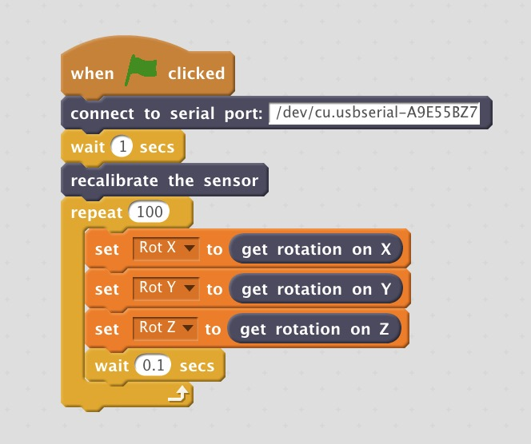

# Werium - Scratch interface

This repository contains a set of tools to connect a [Werium IMU sensor](http://www.weriumsolutions.com/) with [ScratchX](http://scratchx.org/#scratch).

It consists on two components: a local server that connects to the sensor and relays the data on a websocket, and the ScratchX Werium extension which reads the data from the websocket.

The repository also includes an example Scratch model.

## Use
1. Pair Werium via Bluetooth (PIN: 1234) and set the serial port bitrate/baud rate to 57600 (You can also emulate the device using an Arduino and the code in [arduino_werium_emulation](arduino_werium_emulation) folder)

2. Run the server binary from [server](server) folder

3. In [Scratch](http://scratchx.org/#scratch) open the model scratch_model.sb2

4. In Scratch, shift-click on load extension to load werium_extension.js

## Debug, development and building the executable

- Install [node.js](https://nodejs.org) in your computer
- To build the server executables for go to the [server](server) folser and run:
> cd server
>
>npm install pkg
>
> pkg werium_server.js

## Requirements

- A PC with Windows, OSX or Linux, and bluetooth to connect to Werium
- A modern web-browser (tested with Google Chrome 70.0)

## Repo mantainer

This repository is managed by Stefano (to.stefano.piazza@gmail.com).
All the software here contained is released as Open Source using the AGPL License.
